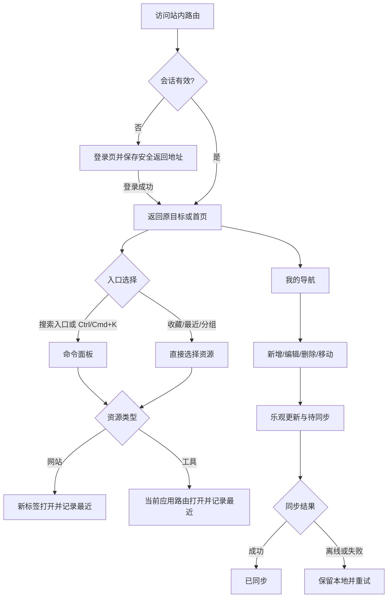

# UI/UX 规范文档：个人统一开发工作台

## 摘要

- **体验主线**：以全局搜索和 `Ctrl/Cmd + K` 命令面板串联网站、工具、收藏与最近使用，任意常用目标在首页两次操作内可达。
- **应用壳**：1280px 桌面使用 248px/72px 可折叠侧栏与 64px 顶栏；768px 及以下改为 56px 顶栏、底部导航和按需抽屉，360px 不产生页面级横向滚动。
- **视觉语言**：深色优先、低饱和天空蓝强调、实体表面为主；玻璃拟态只用于顶栏、命令面板和浮层，并提供无模糊回退。
- **可靠交互**：导航 CRUD、排序、跨分类移动均采用乐观更新，持续展示待同步/同步中/已同步/离线/失败，删除与移动提供 7 秒撤销。
- **实现边界**：直接复用 React、React Router、CSS Variables、Lucide 与现有 dnd-kit，不引入新的 UI 或动效依赖；所有组件满足 WCAG 2.2 AA、键盘操作和 44px 移动触控目标。

## 文档信息

- **功能名称**：个人开发工作台重构
- **版本**：1.0
- **创建日期**：2026-07-24
- **作者**：UI Designer Agent
- **设计模式**：高保真规范（hifi），深色默认，亮色语义预留
- **预览命令**：`boss design preview dev-workbench-refactor`

---

## 1. 设计概述

### 1.1 设计理念

“打开即工作”。界面不再把用户先分流到“导航”或“工具”，而是让搜索、收藏和最近上下文先出现。视觉层级靠明度、边框和间距建立，不靠大面积渐变或悬浮装饰；代码与结果区保留工具感，日常导航区保持安静、清楚。

### 1.2 设计原则

- **一个入口**：首页搜索、顶栏入口和命令面板使用同一索引、同一结果行与同一排序语义。
- **状态透明**：任何云端写入都有文字状态；离线修改不回滚，失败可重试，冲突必须由用户选择。
- **先快后全**：高频操作常驻，编辑与危险操作渐进披露；每个区域最多一个主按钮。
- **一致可迁移**：13 类工具共享“标题/隐私—输入—操作—结果”骨架，学会一个即可使用全部。
- **不依赖感官假设**：颜色同时配图标和文字；所有指针操作均有键盘或菜单等价路径。

### 1.3 信息架构

```text
个人开发工作台
├─ 首页 /
│  ├─ 问候与同步状态
│  ├─ 统一搜索入口
│  ├─ 收藏（最多 8）
│  ├─ 最近使用（首页最多 10）
│  ├─ 常用工具
│  └─ 网站导航分组
├─ 我的导航 /navigation
│  ├─ 分类管理
│  ├─ 网站新增/编辑/删除
│  └─ 排序/跨分类移动/撤销
├─ 工具 /tools/*
│  ├─ 数据与 JSON
│  ├─ 编码与转换
│  ├─ 文本与 Diff
│  ├─ 网络与安全
│  └─ Docker、媒体、速查等现有 13 类
├─ 全局命令面板（任意页浮层）
└─ 登录 /login
```

---

## 2. 用户流程

### 2.1 主流程



### 2.2 核心流程说明

| 步骤 | 页面/组件 | 用户行为 | 系统响应 |
|------|-----------|----------|----------|
| 1 | 应用壳 | 打开任意受保护路由 | 鉴权阶段只展示同构骨架；未登录转到登录并保存站内返回地址 |
| 2 | 首页/顶栏 | 点击搜索或按 `Ctrl/Cmd+K` | 打开唯一命令面板，焦点进入组合框，背景不可交互 |
| 3 | 命令面板 | 输入、方向键选择、Enter 执行 | 本地索引 100ms 内更新；网站开新标签，工具走站内路由 |
| 4 | 导航管理 | 新增、编辑、删除或移动 | 100ms 内乐观更新，显示“待同步”；删除/移动弹出 7 秒撤销 Toast |
| 5 | 工具页 | 输入后按主按钮或 `Ctrl/Cmd+Enter` | 保留输入、按钮进入 loading；成功显示结果，非法输入在输入区附近提示 |
| 6 | 异常恢复 | 断网、同步失败或冲突 | 显示离线横幅/失败重试；冲突对话框明确本地与云端更新时间 |

### 2.3 命令面板键盘模型

| 按键 | 行为 |
|------|------|
| `Ctrl/Cmd + K` | 焦点不在 `input/textarea/select/contenteditable` 时打开；已打开时聚焦查询框，不叠加实例 |
| `ArrowDown / ArrowUp` | 在可见结果间循环移动活动项，滚动使其可见；不移动 DOM 焦点 |
| `Home / End` | 跳到第一/最后一项 |
| `Enter` | 执行活动项；无活动项时不提交外部搜索 |
| `Esc` | 关闭并把焦点还给触发元素；清空仅存在于面板内的查询 |
| `Tab / Shift+Tab` | 焦点圈定在对话框的查询、结果辅助操作和关闭按钮之间 |

查询框使用 `role="combobox"`、`aria-expanded`、`aria-controls`、`aria-activedescendant`；结果容器使用 `role="listbox"`，结果行使用 `role="option"`。空查询依次展示收藏、最近使用、常用工具；有查询时只展示统一结果，类型以“网站/工具”标签区分。

---

## 3. 设计令牌

### 3.1 颜色系统（深色默认）

| Token | 色值 | 用途 |
|-------|------|------|
| `--color-bg` | `#07111F` | 页面底色 |
| `--color-sidebar` | `#091525` | 侧栏与移动抽屉 |
| `--color-surface` | `#0F1B2D` | 卡片、输入和工具面板 |
| `--color-surface-raised` | `#16243A` | 菜单、选中项、浮层实体回退 |
| `--color-surface-hover` | `#1D2E47` | 悬停与轻强调 |
| `--color-border` | `#334155` | 常规边框 |
| `--color-border-subtle` | `#22314A` | 分隔线 |
| `--color-text` | `#F8FAFC` | 标题和正文 |
| `--color-text-secondary` | `#CBD5E1` | 次要说明 |
| `--color-text-muted` | `#94A3B8` | 元数据、占位；不用于小号关键操作 |
| `--color-primary` | `#0369A1` | 主按钮背景，配白字 |
| `--color-primary-hover` | `#075985` | 主按钮悬停 |
| `--color-primary-active` | `#0C4A6E` | 主按钮按下 |
| `--color-accent` | `#38BDF8` | 焦点环、选中描边、同步中 |
| `--color-link` | `#7DD3FC` | 深色背景文本链接 |
| `--color-success` | `#4ADE80` | 已同步、成功 |
| `--color-warning` | `#FBBF24` | 待同步、冲突、离线 |
| `--color-error` | `#F87171` | 错误与危险提示 |
| `--color-info` | `#60A5FA` | 信息状态 |
| `--color-overlay` | `rgba(2, 6, 23, .72)` | Modal/Drawer 遮罩 |

主按钮白字与 `#0369A1`、正文与底色、辅助文字与表面均按 WCAG AA 校验；状态不可只使用颜色，必须配 Lucide 图标和短文案。亮色模式可在后续以语义 token 覆盖，不在 P0 增加主题切换复杂度。

### 3.2 玻璃与阴影

- 常规卡片使用不透明 `--color-surface` + 1px 边框，不使用模糊。
- 顶栏、命令面板和 Toast 可用 `rgba(15,27,45,.88)` + `backdrop-filter: blur(16px)`；`@supports` 不成立时回退 `#0F1B2D`。
- `--shadow-float: 0 16px 48px rgba(0,0,0,.36)` 仅用于命令面板、对话框、抽屉。
- `--shadow-card: 0 8px 24px rgba(0,0,0,.16)` 仅用于悬停中的可点击卡片；静态卡片不依赖阴影分层。

### 3.3 排版系统

```css
--font-sans: Inter, -apple-system, BlinkMacSystemFont, "Segoe UI", "PingFang SC", "Microsoft YaHei", sans-serif;
--font-mono: "SFMono-Regular", "Cascadia Code", Consolas, monospace;
```

| 名称 | 字号/行高 | 字重 | 用途 |
|------|-----------|------|------|
| Display | 32/40px（移动 28/36px） | 700 | 首页问候 |
| H1 | 28/36px（移动 24/32px） | 700 | 页面标题 |
| H2 | 20/28px | 650 | 首页模块、工具区块 |
| H3 | 16/24px | 600 | 卡片标题、分类标题 |
| Body | 16/24px | 400 | 正文、输入 |
| Small | 14/20px | 400/500 | 描述、导航项 |
| Caption | 12/16px | 500 | 类型标签、时间、快捷键 |
| Code | 14/22px | 400 | 工具输入/结果，使用等宽字体 |

### 3.4 间距、圆角与尺寸

间距以 4px 为基础：`4, 8, 12, 16, 20, 24, 32, 40, 48, 64`。页面左右留白：360px 为 16px，768px 为 24px，1280px 为 32px；内容最大宽度 1440px。

| Token | 值 | 用途 |
|-------|----|------|
| `--radius-sm` | 6px | 标签、快捷键键帽 |
| `--radius-md` | 10px | 输入、按钮、导航项 |
| `--radius-lg` | 14px | 卡片、结果区 |
| `--radius-xl` | 18px | 命令面板、对话框 |
| `--control-sm` | 36px | 桌面紧凑辅助控件；移动端点击盒仍需 44px |
| `--control-md` | 44px | 默认按钮、输入、图标按钮 |
| `--control-lg` | 52px | 首页搜索、登录主按钮 |

### 3.5 动效

| Token | 参数 | 用途 |
|-------|------|------|
| fast | `150ms cubic-bezier(0,0,.2,1)` | hover、focus、颜色 |
| normal | `220ms cubic-bezier(.4,0,.2,1)` | 面板、抽屉、折叠 |
| slow | `300ms cubic-bezier(0,0,.2,1)` | Modal 进入，不用于整页装饰 |

`prefers-reduced-motion: reduce` 时禁用位移、缩放、平滑滚动与 shimmer；所有时长降至 `1ms`，loading 保留静态图标和文字，不以旋转作为唯一提示。

---

## 4. 应用壳与响应式规范

### 4.1 桌面 1280px 及以上

```text
┌────────────── 248/72 ──────────────┬──────────────────────────────┐
│ Logo / 折叠                         │ 64px 顶栏：页面名 | ⌘K | 同步 │
│ 首页                                ├──────────────────────────────┤
│ 我的导航                            │                              │
│ 工具分组（可滚动）                   │ 主内容，32px 留白，max 1440px │
│                                     │                              │
│ 账户 / 退出                         │                              │
└─────────────────────────────────────┴──────────────────────────────┘
```

- 侧栏展开 248px，折叠 72px；折叠态仅显示图标并用 Tooltip 命名，折叠偏好本地保存。
- 顶栏命令入口宽 320–480px，展示 `搜索网站或工具` 与平台对应的 `Ctrl K`/`⌘ K` 键帽。
- 侧栏与顶栏固定，主内容独立滚动；当前项同时使用 3px 左强调条、表面色和 `aria-current="page"`。

### 4.2 中等屏 769–1279px

- 默认使用 72px 图标栏；点击菜单以 280px 临时抽屉覆盖，不挤压内容。
- 首页卡片为 2–3 列；工具双栏仅在每栏可保持至少 360px 时启用。
- 768px 属于移动规则，避免平板竖屏边界出现两套导航。

### 4.3 移动 360–768px

- 顶栏 56px：菜单、当前页短标题、同步图标/文字；同步详情点击后显示底部 Sheet。
- 底部导航高度 64px + `env(safe-area-inset-bottom)`，固定 5 项：`首页`、`搜索`、`导航`、`工具`、`更多`；图标 22px，点击盒至少 44×44px。
- `搜索`打开全屏命令面板；`工具`与`更多`打开底部 Sheet/左侧抽屉，列出工具分组、账户、同步重试和退出。
- 主内容底部 padding 至少 `88px + safe-area`；软键盘出现时面板使用 `100dvh`，结果列表独立滚动，查询框与关闭按钮保持可见。
- 首页、导航卡片和工具编辑器全部单列；任何代码区域使用自身横向滚动，不让 body 溢出。

---

## 5. 页面规范

### 5.1 登录页 `/login`

- 全屏深色背景，左上轻量品牌标识；桌面居中 400px 表单卡，360px 为满宽无阴影表面，左右 20px。
- 标题“欢迎回来”，说明“登录你的个人开发工作台”；邮箱、密码、显示密码按钮、主按钮“登录”，次级文本入口“创建账号”。
- 密码错误显示字段级说明和页内 `role="alert"` 摘要；提交后按钮保持宽度，Spinner + “正在登录”，输入保持，禁止重复提交。
- 登录成功返回已验证的站内目标；鉴权加载用表单同构骨架，绝不闪现工作台数据。
- 会话失效文案：“登录状态已过期，请重新登录。未同步内容仍保留在此设备。”

### 5.2 首页 `/`

顺序固定：

1. **问候行**：基于本地时间显示“早上好/下午好/晚上好，{用户名}”；右侧显示同步状态入口。
2. **统一搜索**：52px 高、全宽上限 760px，搜索图标、占位“搜索网站、工具或命令…”，右侧键帽；点击只打开命令面板，不在首页维护第二套结果。
3. **收藏**：最多 8 项，桌面 4–8 列、768px 4 列、360px 2 列；网站与工具用类型角标区别，右上星标可取消收藏。
4. **最近使用**：最多 10 项，桌面紧凑列表/横向两列，移动单列；显示名称、类型、相对时间，删除失效引用时 Toast 说明。
5. **常用工具**：根据固定推荐 + 使用频率展示 6 项，不因没有历史而消失。
6. **导航分组**：按分类显示网站卡，模块标题提供“管理导航”；移动默认每组展示前 4 项并可展开。

空收藏显示星形图标、“把常用网站或工具固定到这里”和“浏览工具”；空最近显示时钟图标、“打开过的内容会出现在这里”和“开始搜索”。首屏骨架必须模拟上述真实布局。

### 5.3 命令面板（全局浮层）

- 桌面：顶距 12vh，宽 `min(680px, calc(100vw - 32px))`，最大高 70vh；移动：100dvh 全屏，无圆角。
- 顶部 56px 查询区，下方分组标题 + 48px 结果行，底部快捷键说明仅桌面显示。
- 结果行包含 20px Lucide/站点图标、主名称、命中摘要、类型标签；活动项使用 `--color-surface-hover` 与 2px 内描边。
- 搜索中仅在耗时超过 150ms 时显示微型加载；结果刷新保持活动资源 ID，若资源消失再落到第一项。
- 无结果：标题“没有找到匹配项”，提供“清除搜索”和“新增网站”，禁止把查询发送到外部搜索引擎。

### 5.4 我的导航 `/navigation`

- 页面头：标题、可见同步状态、搜索/过滤、`编辑布局`、`新增网站`；编辑模式补充 `新增分类` 与退出编辑按钮。
- 分类为描边 Section：头部含拖拽手柄、名称、数量和更多菜单；网站桌面卡片网格，移动为紧凑列表。
- 网站卡包含图标、名称、域名/描述、收藏和更多菜单；标题最多两行，URL 使用省略并在 Tooltip 中显示完整域名。
- 新增/编辑使用自定义 Dialog：名称（80）、URL（2048）、描述（240）、图标、分类。名称/URL 必填，协议建议不得自动无提示修改；`javascript:`/`data:` 直接拒绝。
- 删除网站对话框显示名称；删除非空分类显示网站数量和影响。焦点默认停在“取消”，危险按钮文案具体为“删除网站/删除分类”。
- 桌面用专用手柄拖拽；Space 抓取/放下、方向键移动、Esc 取消，并用 `aria-live` 播报位置。搜索过滤时手柄禁用，解释“清除筛选后可排序”。
- 移动端不依赖触摸拖拽：更多菜单提供“移至分类”“上移”“下移”“编辑”“删除”。
- 删除或移动后 Toast 保留 7 秒并含“撤销”；撤销动作进入同一同步队列。

### 5.5 工具页 `/tools/*`

所有现有 13 类工具使用 `ToolShell`：

```text
标题 + 描述 + [仅本地处理/外部请求说明] + 收藏
┌──────────────────── 输入区 ────────────────────┐
│ label / 帮助 / textarea-editor / 字段级错误     │
└────────────────────────────────────────────────┘
[载入示例] [清空]                [主操作 Ctrl+Enter]
┌──────────────────── 结果区 ────────────────────┐
│ 状态标题 / 结果 / 复制 / 下载（仅适用时）       │
└────────────────────────────────────────────────┘
```

- 1280px：适合对照的工具可用 `minmax(0,1fr) minmax(0,1fr)` 双栏，操作条跨栏或固定在输入区底部；其余保持单列上限 1040px。
- 768px/360px：严格按输入→操作→结果堆叠；编辑器最小高 220px，结果最小高 160px并独立滚动。
- 主操作使用 `Ctrl/Cmd+Enter`，loading 时保留输入、禁用重复执行；“载入示例”“清空”是次/幽灵按钮，复制位于结果标题栏。
- 未执行结果显示“结果将在这里显示”；成功展示结果与摘要；空成功写明“处理成功，无输出”；失败在输入附近给出可修正原因，结果区保留上次成功结果时标注“上次结果”。
- 本地算法固定展示带 Lock 图标的“仅在浏览器本地处理”；外部调用在按钮旁写明服务目标与目的，必须由用户显式触发。

### 5.6 全局错误页与恢复页

- 应用错误边界保留品牌、错误标题、简短说明、“重试”“返回首页”；不显示堆栈、令牌、URL 参数或工具输入。
- 首次读取失败且有缓存：继续展示缓存并置顶离线横幅；无缓存：错误页显示重试。
- 404 与权限失败分别使用 FileQuestion/ShieldAlert 图标，主动作均回首页，不能共用“暂无数据”文案。

---

## 6. 组件规范

### 6.1 Button / IconButton

| 变体 | 用途 | 样式 |
|------|------|------|
| Primary | 每区域唯一主操作 | `#0369A1` 背景、白字 |
| Secondary | 次操作 | 透明背景、`#475569` 边框、浅色文字 |
| Ghost | 工具栏/低优先级 | 无边框，hover 使用表面色 |
| Danger | 确认危险动作 | 深红实体背景、白字；仅确认区使用 |

- 默认高 44px；登录/首页搜索相关主控件 52px；桌面紧凑图标视觉可为 36px，但点击盒 40px，移动一律至少 44px。
- 状态必须包含 default/hover/active/focus-visible/disabled/loading；loading 仍保留可访问名称，`aria-disabled` 或原生 `disabled`。
- 图标按钮必须有 `aria-label` 和 Tooltip，Lucide 默认 18–20px；装饰图标 `aria-hidden="true"`。

### 6.2 Input / Search / Editor

- 默认高 44px，首页搜索 52px；背景 `--color-surface`，1px 边框，聚焦为 2px `--color-accent` 外环并保持布局不跳动。
- label 永久可见；placeholder 只提供示例，不替代 label。错误时边框、AlertCircle 图标和文本同时出现，以 `aria-describedby` 关联。
- 编辑器使用等宽字体、`min-width:0`、可调整高度；敏感输入禁用浏览器持久化建议并明确不保存。

### 6.3 ResourceCard / ResultRow

- `ResourceCard` 支持 website/tool、compact/grid、favorite、active、disabled；整卡可点击时内部收藏/菜单按钮必须阻止冒泡并有独立焦点。
- `ResultRow` 固定最小高 48px，名称单行省略，摘要最多一行；活动状态与鼠标 hover 语义一致。
- favicon 失败回退到 Globe；工具统一使用 Lucide 图标，不使用彩色 emoji 作为状态主体。

### 6.4 SyncIndicator / OfflineBanner

| 状态 | 图标 | 文案 | 行为 |
|------|------|------|------|
| pending | Clock3 | 待同步 | 点击查看队列数量 |
| syncing | RefreshCw | 同步中 | `aria-live=polite`，不频繁播报进度 |
| synced | CloudCheck | 已同步 | 3 秒后收敛为图标，详情保留最后同步时间 |
| offline | WifiOff | 离线，修改已保存在本机 | 顶部横幅，恢复后自动重试 |
| failed | CloudOff | 同步失败 | 提供“重试”，不回滚本地修改 |

冲突使用 Modal，不使用 Toast：并列展示“本地修改时间/云端更新时间”，主次对等按钮“保留本地”“使用云端”，另有“稍后处理”。

### 6.5 Toast

- 桌面右上、移动底部导航上方；宽 320–420px，移动 `calc(100vw - 32px)`。
- success/info 4 秒，warning/error 6 秒；删除/移动撤销 7 秒。可关闭，悬停和键盘聚焦时暂停计时。
- 使用 `role="status"`（常规）或 `role="alert"`（需立即处理的错误）；同类重复提示合并计数，避免播报风暴。

### 6.6 Dialog / Drawer / Sheet

- Dialog 桌面最大宽 520px，移动最大宽 100% 且贴底或全屏；背景遮罩 `.72`，首焦点按风险语义设置。
- 必须锁定背景滚动、圈定焦点、Esc 关闭（不可中断提交阶段除外）、关闭后恢复触发焦点。
- Drawer 宽 300px（最大 88vw），Sheet 最大高 85dvh；拖拽手势不是唯一关闭方式，始终保留 44px 关闭按钮。

### 6.7 Empty / Loading / ErrorState

- 骨架模拟页面结构；超过 10 秒替换为“加载时间较长”并提供重试。
- 空数据与过滤无结果文案/动作不同；错误必须给出下一步，不能只显示 Spinner 或“出错了”。
- Skeleton 的 shimmer 在 reduced-motion 下变为静态；区域 loading 使用 `aria-busy="true"`。

---

## 7. 交互与状态规范

### 7.1 状态矩阵

| 场景 | 视觉/文案 | 主操作 | 数据规则 |
|------|-----------|--------|----------|
| 首次加载 | 同构骨架 | 超 10 秒可重试 | 不显示旧个人数据闪烁 |
| 真空数据 | 友好图标 + 原因 | 创建第一项 | 不与加载失败混淆 |
| 过滤无结果 | “没有匹配项” | 清除筛选/新增网站 | 不改变源数据 |
| 离线有缓存 | 离线横幅 + 缓存内容 | 继续编辑/查看详情 | 修改进入持久化队列 |
| 同步失败 | 状态指示 + 重试 | 重试 | 不回滚乐观更新 |
| 权限/会话失败 | ShieldAlert | 重新登录 | 清除内存个人云数据 |
| 未知异常 | 错误边界 | 重试/首页 | 不泄漏敏感上下文 |

### 7.2 表单、危险操作与撤销

- 输入时 300ms 延迟校验，失焦立即校验，提交全量校验并聚焦首个错误。
- 普通保存不二次确认；删除网站、删除非空分类、放弃待同步修改需要自定义确认对话框。
- 可恢复的移动/删除优先用 Undo Toast；撤销窗口后再按队列正常同步，文案不得承诺服务端已永久删除。

### 7.3 复制与工具反馈

- 复制成功 Toast：“已复制到剪贴板”；失败：“无法自动复制，请手动选择结果”，并自动选中/聚焦只读结果区。
- 执行成功不总弹 Toast，结果区状态已经足够；仅跨页面、复制、保存等不易在原位观察的动作弹 Toast。
- 敏感内容不写入最近、日志或云端；清空立即执行但可在当前会话内提供一次撤销更佳。

---

## 8. 无障碍规范

- 正文对比度 ≥ 4.5:1，大字 ≥ 3:1，图标/边框/焦点等非文本 UI ≥ 3:1；设计 token 之外的临时颜色不得直接写入组件。
- 页面首个可聚焦元素为“跳到主内容”；使用 `header/nav/main/section` 语义和唯一 H1。
- 焦点样式：`2px solid #38BDF8` + `2px offset`，不得用 `outline:none` 移除；拖拽、菜单、Tab、命令面板均有完整键盘路线。
- 所有移动点击目标 ≥ 44×44px，相邻目标间距 ≥ 8px；桌面主要控件仍推荐 40–44px。
- 图标按钮有可访问名称；同步、Toast、排序位置、表单错误由恰当的 `aria-live` 播报，装饰图标隐藏。
- Modal/命令面板使用 `role="dialog" aria-modal="true"`；列表导航采用 combobox/listbox 模式，不混用按钮语义。
- 尊重 `prefers-reduced-motion` 和 200% 字体缩放；360px、400% 缩放下不依赖双列，不遮挡提交按钮。

---

## 9. 实现映射与交付检查

### 9.1 现有技术映射

- 复用 `Sidebar.tsx` 的工具清单，将其提升为集中资源索引；页面壳保留 React Router `NavLink`。
- 用现有 Lucide 图标覆盖导航、状态、动作，不引入图标包；继续用现有 dnd-kit 的 Pointer/Keyboard sensor。
- `App.css`/`index.css` 增加语义变量并为旧变量提供别名，逐页迁移，避免一次性破坏工具页。
- 将 `Navigation.tsx` 的原生 `prompt/confirm` 替换为共享 Dialog；内联样式逐步迁入组件 class。
- 13 个工具页复用 `ToolShell`、`ToolInputPanel`、`ToolActionBar`、`ToolResultPanel`，不改变各工具核心算法。

### 9.2 交付检查

- [x] `.boss/dev-workbench-refactor/ui-spec.md` 已完整定义页面、组件、状态、响应式、无障碍与实现映射。
- [x] `.boss/dev-workbench-refactor/ui-design.json` 与本文使用相同 token、断点、页面和交互契约。
- [x] 无模板占位符，无需等待设计变体选择。
- [x] 已覆盖 360/768/1280、reduced-motion、44px 触控、命令面板键盘模型与离线恢复。

## 变更记录

| 版本 | 日期 | 作者 | 变更内容 |
|------|------|------|----------|
| 1.0 | 2026-07-24 | UI Designer Agent | 首次完成个人统一开发工作台高保真 UI/UX 规范 |
